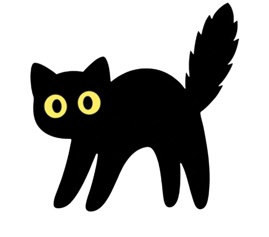

<h1 align="center">🐱 Tsuki 🐱</h1>

## 🧠 About Me
- 🧠 18 ans, étudiant à **Coda School**, une école d’informatique d'Orléans
- 💬 J’aime tester, créer, louper, recommencer, et apprendre avec tout ce qui me tombe sous la main (mais avec style) 
- 🎮 Fan de **Minecraft** et **Subnautica** — j’aime les mondes où tu peux construire et explorer
- ⚙️ Mon but : m'amuser en codant tout et n'importe quoi

## 🛠️ Tech Stack

  

## 📊 GitHub Stats

  

  

  

